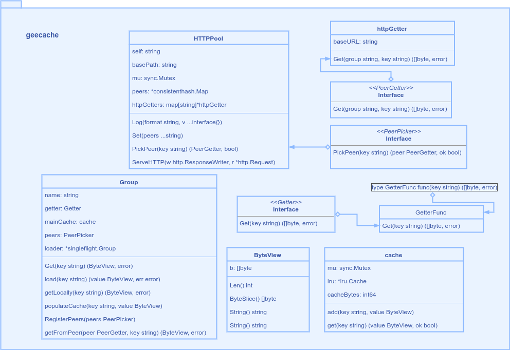
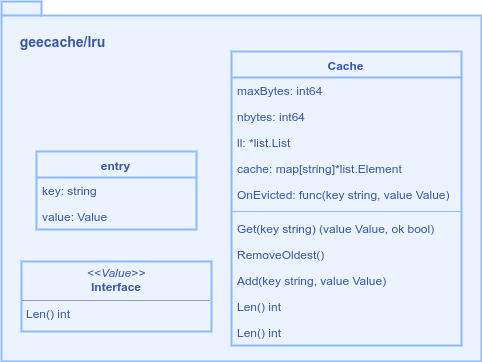
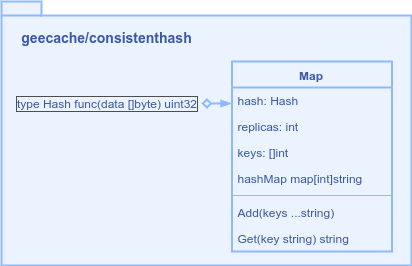
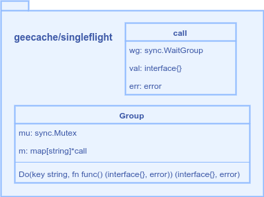

# gee-cache
learn base framework form [geektutu](https://geektutu.com/post/geecache.html) 7-days series

geecache Server

geecache lru

geecache consistenthash

geecache singleflight

TODO
- [ ] fulfill doc  